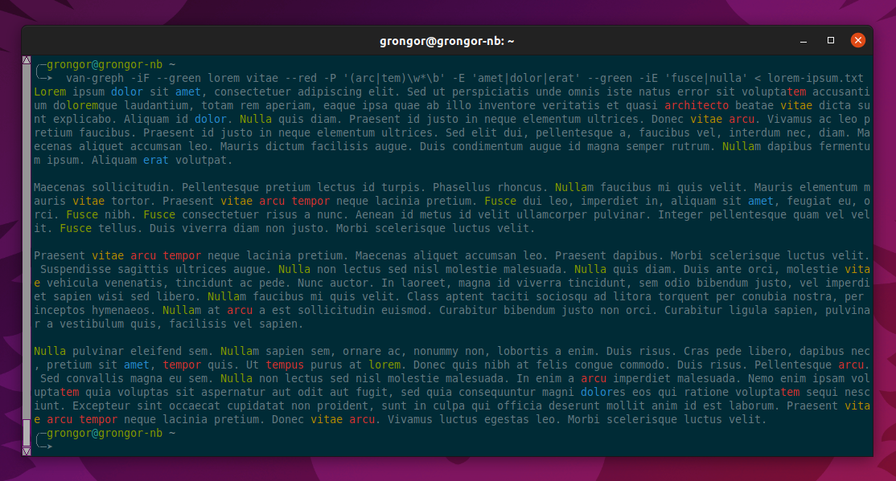

# van-greph


Bash script that reads `stdin`, and based on the options given to it, matches and colors the input and outputs
it to `stdout`. It doesn't filter anything, just adds colors. You may find it very handy when trying to find some
patterns in large dataset.



## Usage

First, put it somewhere where you can execute it; somewhere in your `$PATH`.

Then you can try something simple:
```bash
printf "hello\nworld\n" | van-greph ll wo d
```

Or maybe infinite rainbow? Go for it:
```bash
base64 </dev/urandom | van-greph --green 'a.*c' 'd.*f' --yellow '0.*5' --pink '6.*9'
```

To find out all about this utility, you can run `van-greph --help`, and it will tell you everything:
```
Usage: van-greph [-z] [[OPTION]... FILTER]...

Colors text from standard input based on OPTION(s) per FILTER(s) and outputs to
standard output. Some of the options are directly mapped to the grep options.

FILTER is a pattern to match. How exactly will the FILTER be used depends on
the given OPTION(s), it may be a simple string match (-F) or a match using
regular expressions (one of -E and -G options).

Available OPTION(s):

  -E, --extended-regexp Next FILTER is extended regular expression
  -F, --fixed-strings   Next FILTER is string
  -G, --basic-regexp    Next FILTER is basic regular expression
  -P, --perl-regexp     Next FILTER is Perl regular expression
  -i, --ignore-case     Next FILTER will ignore case distinctions
                        in pattern and data
  -z, --null-data       A data line ends in 0 byte, not newline
  -f, --file=FILE       For -f it treats next FILTER as a file from which to
                        read the patterns, for --file it does the same thing
                        but takes FILE directly (FILTER must be omitted)
  --bg, --background    Next matched FILTER will have its background colored
                        instead of foreground as usual
  --COLOR               Uses COLOR as a color for next FILTER (instead of
                        choosing automatically).

                        Available COLORs are:
                        black cyan yellow blue red pink white green purple
  --                    indicates the unambiguous end of options of next FILTER

Examples:
  # Color each name differently:
  van-greph Jane John --black Batman \
      <<<'One day, Jane met John and they saw Batman.'

  # Infinite rainbow:
  base64 </dev/urandom | \
      van-greph --green 'a.*c' 'd.*f' --yellow '0.*5' --pink '6.*9'

Why van-greph? Because this script can paint too :)
Thanks @simpod, great name suggestion!
```

## Caveats

### Mac

If you are on Mac, you will probably need to do some magic like I did in the [CI](.github/workflows/ci.yaml) to get
this working, because I use some "advanced" features of bash/grep/sed, that ancient versions installed on Mac
by default can't do.

### Script is stuck

If van-greph gets stuck, try running it again with environment variable `GREP_C=999999999`.
I wasn't able to reproduce this locally, but in Github Actions the command would take forever to complete
and this hack was "a solution". Please let me know if you encounter this or if you have any insight into the issue.
